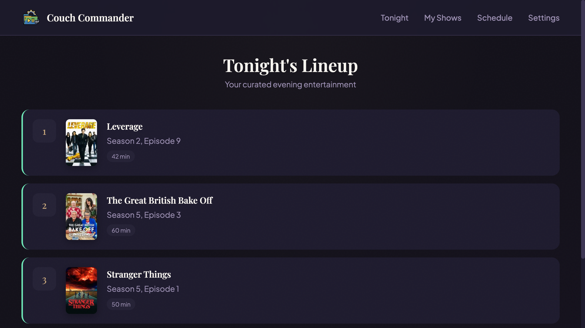
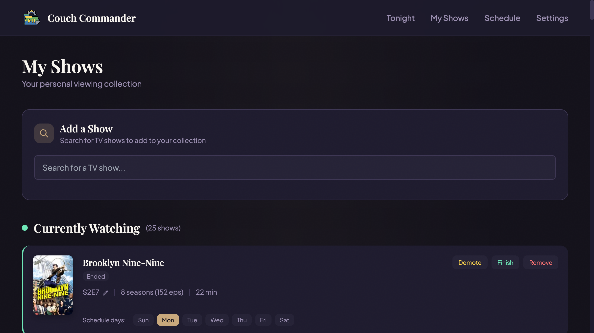
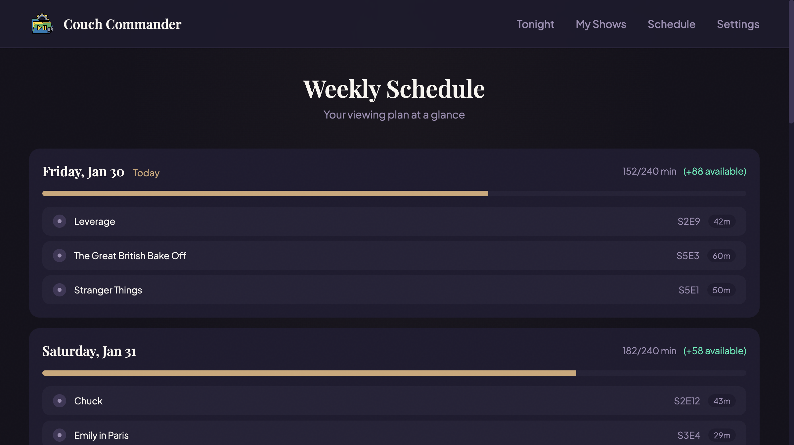
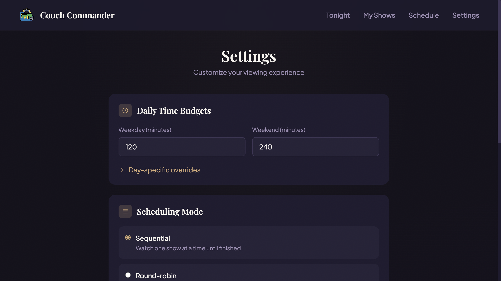

# Couch Commander

Your personal TV concierge. Take control of your viewing schedule instead of endlessly scrolling through streaming apps.


## What It Does

Couch Commander helps you manage your TV watching by:

- **Building a watchlist** - Search for shows via TMDB and add them to your queue
- **Creating viewing schedules** - Assign shows to specific days of the week
- **Tracking progress** - Know exactly where you are in each series
- **Managing your time** - Set daily viewing budgets so you don't binge too hard
- **Checking episode availability** - Only schedule episodes that have actually aired

Perfect for cord-cutters juggling multiple streaming services, families coordinating shared TV time, or anyone who wants to be more intentional about their entertainment.

## Features

- **Show Search** - Find any TV show using TMDB's extensive database
- **Queue System** - Add shows to a queue, then promote them when ready to watch
- **Day Assignments** - Assign shows to specific days (Movie Monday, Documentary Thursday, etc.)
- **Time Budgets** - Set per-day minute limits for weekdays and weekends
- **Episode Tracking** - Track which season/episode you're on
- **Check-ins** - Quick daily check-ins to mark what you watched
- **Scheduling Modes** - Sequential, round-robin, or genre-based scheduling
- **Staggered Start** - Option to finish one show before starting another

## Screenshots

*Dashboard - Tonight's Lineup*


*My Shows - Watchlist Management*


*Weekly Schedule*


*Settings*


## Quick Start

### Prerequisites

- [TMDB API Key](https://www.themoviedb.org/settings/api) (free)

### Option 1: Docker (Recommended for NAS/Server)

1. Clone the repo:
   ```bash
   git clone https://github.com/yourusername/couch-commander.git
   cd couch-commander
   ```

2. Create a `.env` file:
   ```bash
   echo "TMDB_API_KEY=your_api_key_here" > .env
   ```

3. Run with Docker Compose:
   ```bash
   docker-compose up -d
   ```

4. Open http://localhost:4242

**Data Persistence:** Your database is stored in a Docker volume and survives container restarts.

### Option 2: Local Development

1. Clone and install:
   ```bash
   git clone https://github.com/yourusername/couch-commander.git
   cd couch-commander
   npm install
   ```

2. Create `.env`:
   ```bash
   cp .env.example .env
   # Edit .env and add your TMDB_API_KEY
   ```

3. Set up the database:
   ```bash
   npx prisma db push
   ```

4. Build CSS and start:
   ```bash
   npm run css:build
   npm run dev
   ```

5. Open http://localhost:5055

## Synology NAS Setup

1. Copy the project to your NAS:
   ```
   /volume1/docker/couch-commander/
   ```

2. SSH into your NAS and navigate there:
   ```bash
   cd /volume1/docker/couch-commander
   ```

3. Create `.env` with your TMDB key:
   ```bash
   echo "TMDB_API_KEY=your_api_key_here" > .env
   ```

4. Build and run:
   ```bash
   sudo docker-compose up -d --build
   ```

5. Access at `http://your-nas-ip:4242`

**Troubleshooting:**
- If port 4242 is taken, edit `docker-compose.yml` and change the port mapping
- Check logs with `sudo docker-compose logs`
- Restart with `sudo docker-compose restart`

## Configuration

### Settings Page

Access `/settings` to configure:

- **Daily Time Budgets** - How many minutes per day you want to watch
- **Day Overrides** - Custom budgets for specific days
- **Scheduling Mode** - How shows are scheduled:
  - *Sequential* - Finish one show before starting another
  - *Round-robin* - Rotate through all active shows
  - *Genre-based* - Schedule based on genre rules
- **Staggered Start** - Wait N episodes before starting next show

### Environment Variables

| Variable | Required | Default | Description |
|----------|----------|---------|-------------|
| `TMDB_API_KEY` | Yes | - | Your TMDB API key |
| `DATABASE_URL` | No | `file:./dev.db` | SQLite database path |
| `PORT` | No | `5055` (dev) / `4242` (docker) | Server port |

## Usage

### Adding Shows

1. Go to **My Shows** (`/watchlist`)
2. Search for a show in the search box
3. Click **Add** to add it to your queue

### Promoting Shows

Shows start in the **Queue**. When you're ready to watch:

1. Click **Promote** on a queued show
2. Select which days you want to watch it
3. The show moves to **Currently Watching**

### Daily Schedule

The **Tonight** dashboard (`/`) shows:
- Today's scheduled episodes
- Yesterday's check-in (mark what you watched)
- Total runtime for the evening

### Weekly View

The **Schedule** page (`/schedule`) shows your full week with:
- Episodes per day
- Time budget usage
- Capacity remaining

## Tech Stack

- **Backend:** Node.js, Express, TypeScript
- **Database:** SQLite with Prisma ORM
- **Frontend:** EJS templates, htmx, Tailwind CSS
- **Data:** TMDB API for show information
- **Deployment:** Docker

## Development

```bash
# Run tests
npm test

# Run in watch mode
npm run dev

# Build for production
npm run build

# Rebuild CSS
npm run css:build
```

## License

MIT

---

Built with ☕ and 📺 by [Your Name]
