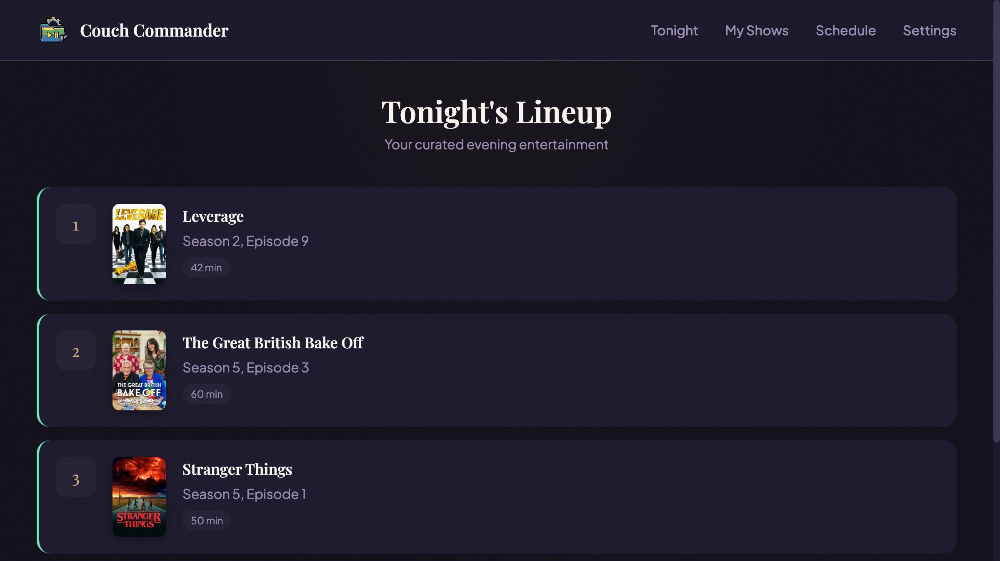
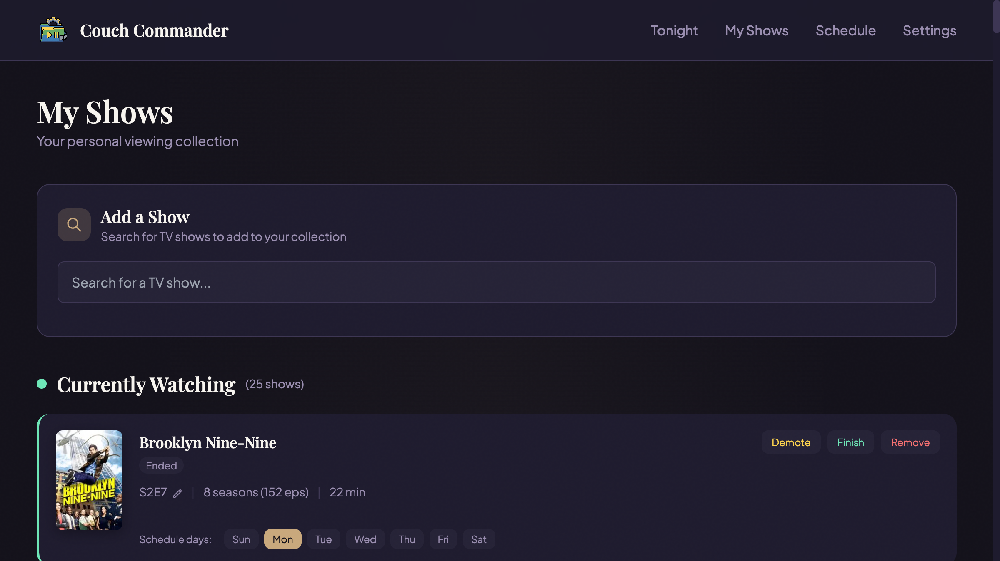
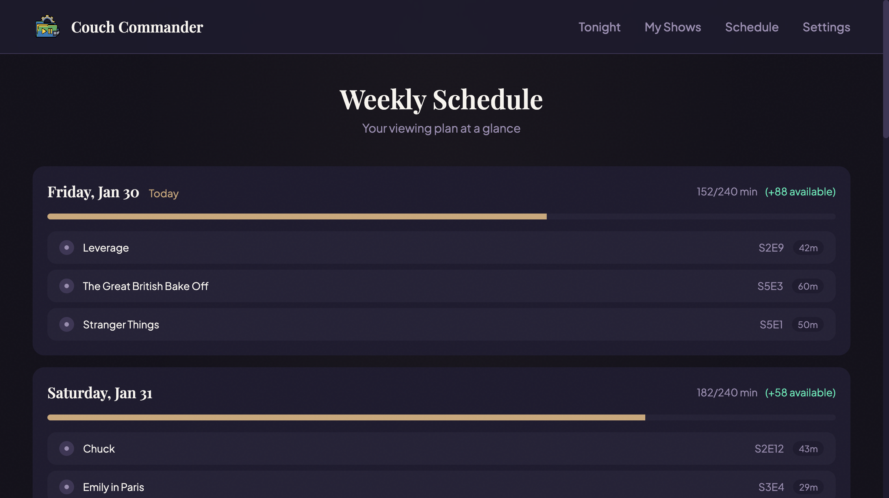
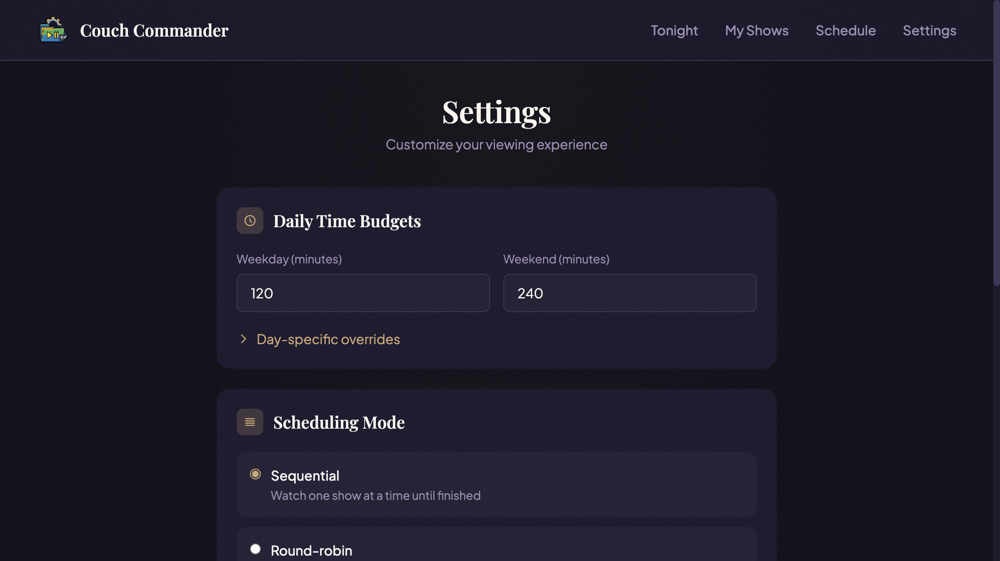

# Couch Commander

TV schedule manager that sits alongside your *arr stack. Build a watchlist, assign shows to days, and get a daily lineup — no more staring at Netflix for 20 minutes deciding what to watch.

## What it is

Couch Commander gives you a personal TV concierge. Search for shows via TMDB, add them to a watchlist, assign them to viewing days, and the app generates a daily schedule from what's actually aired. Set time budgets per day so you know when you've hit your limit. Check in after watching and it advances your progress automatically. It runs as a Docker container on port 4242 — same neighborhood as Sonarr, Radarr, and the rest of your media stack.

## Screenshots

*Dashboard — Tonight's Lineup*


*My Shows — Watchlist Management*


*Weekly Schedule*


*Settings*


## Quick Start

Get a free TMDB API key at [themoviedb.org/settings/api](https://www.themoviedb.org/settings/api). Takes about two minutes.

Copy the example compose file:

```bash
cp docker-compose.example.yml docker-compose.yml
```

Edit `docker-compose.yml` and replace `your_key_here` with your TMDB API key, then:

```bash
docker compose up -d
```

Open [http://localhost:4242](http://localhost:4242).

Your database lives in `./couch-commander-data/` on the host — back that directory up.

## Configuration

| Variable | Required | Default | Description |
|----------|----------|---------|-------------|
| `TMDB_API_KEY` | Yes | — | TMDB API key for show data |
| `API_KEY` | No | — | Protect API endpoints (`X-Api-Key` header) |
| `PORT` | No | `4242` | Internal port |
| `DATABASE_URL` | No | `file:/data/couch-commander.db` | SQLite database path |

## Adding to your *arr stack

Couch Commander fits naturally alongside Sonarr, Radarr, and Plex. It doesn't talk to them directly — it's a scheduling layer on top of whatever you're already watching. Same Docker network, same Nginx Proxy Manager setup, same Homepage dashboard.

**Homepage widget** support is available via `/api/v1/system/status`. Add it to your Homepage config like any other service using the `X-Api-Key` header if you've set `API_KEY`.

## API

All endpoints under `/api/v1/` require the `X-Api-Key` header when `API_KEY` is set. The healthcheck endpoint is always unauthenticated.

| Method | Endpoint | Auth | Description |
|--------|----------|------|-------------|
| `GET` | `/ping` | No | Healthcheck — returns `pong` |
| `GET` | `/api/v1/system/status` | Yes | App version, uptime, environment |
| `GET` | `/api/v1/health` | Yes | Component health (database, TMDB) |
| `GET` | `/api/v1/shows/search?q=...` | Yes | Search shows via TMDB |
| `POST` | `/api/v1/watchlist` | Yes | Add a show to the watchlist |

Example request with auth:

```bash
curl -H "X-Api-Key: your_secret_key" http://localhost:4242/api/v1/system/status
```

## Development

This project uses [Doppler](https://doppler.com) for secrets management. After cloning:

```bash
doppler setup --no-interactive
npm install
npm run db:push
npm test
npm run dev
```

The dev server runs on port 4242 by default. Doppler wraps `npm test` and `npm run dev` automatically — no `.env` file needed locally.

**Other useful commands:**

```bash
npm run css:build     # rebuild Tailwind CSS
npm run db:studio     # open Prisma Studio
npm run build         # compile TypeScript for production
```

## License

MIT
